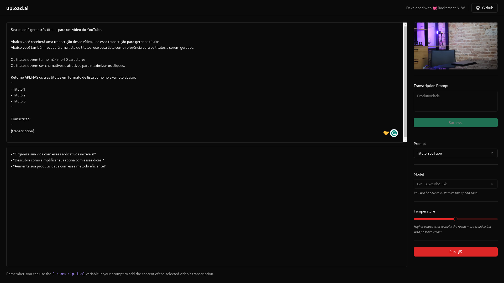

# Upload AI WEB

Frontend developed during NLW AI Mastery event by Rocketseat.


## Overview

The Frontend is seamlessly integrated with the [Backend](https://github.com/elciosato/nlw13-mastery-upload-ai-api). Featuring a simple and intuitive interface, the application can convert a video MP4 file into an audio MP3 file on the client side (WebAssembly). The converted file and the specified parameters are then sent to the backend for processing.

## Installation

```bash
# Clone the repository
git clone https://github.com/elciosato/nlw13-mastery-upload-ai-web.git

# Install dependencies
cd nlw13-mastery-upload-ai-web/
pnpm install

# Create the .env file
DATABASE_URL="file:./dev.db"
OPENAI_KEY="your OpenAI key"

# Sync the database objects
pnpm prisma migrate dev

# Startup the server
pnpm run dev
```

## Usage

```bash
Local:   http://localhost:5173/
```

